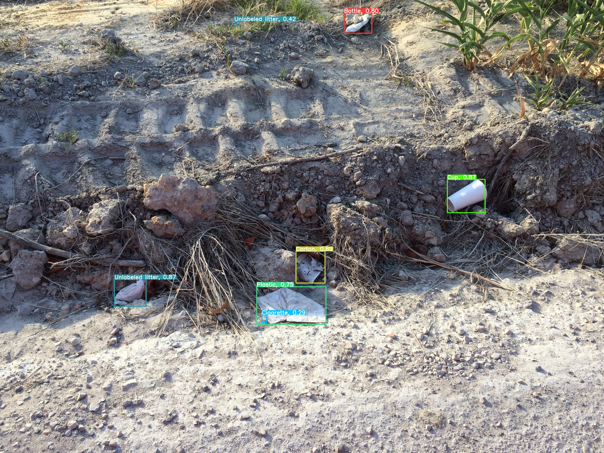
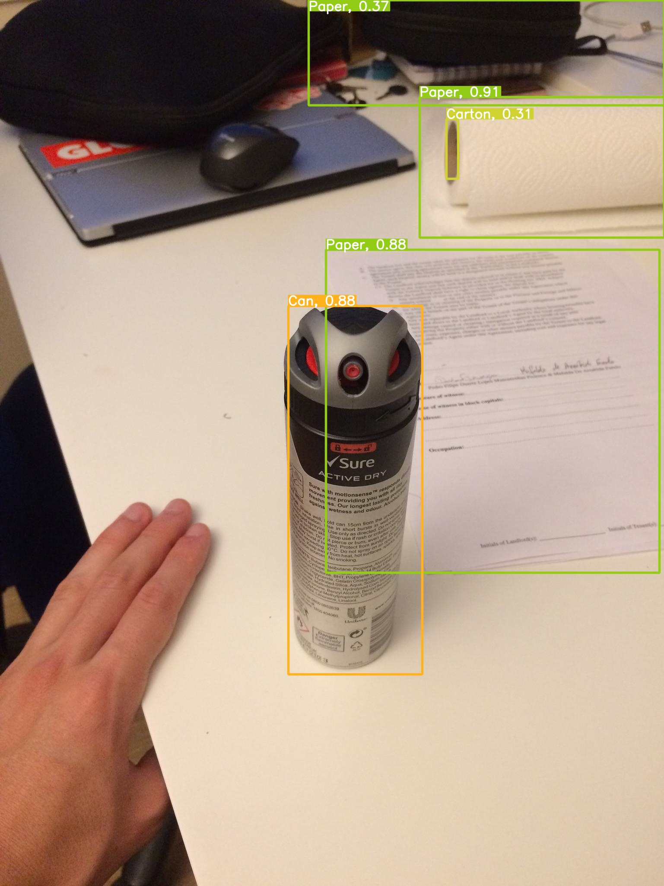

# Waste Detectioni API

<p float="left">
  
   
  
  
</p>

## Tools

* Model: [Yolov5](https://github.com/ultralytics/yolov5) & [Yolov8](https://ultralytics.com/yolov8)

* Dataset: [TACO](http://tacodataset.org) trash detection dataset

* API: [fastapi](https://fastapi.tiangolo.com)

## Type of waste

| # | Names |
|---|---|
| 0 | Bottle |
| 1 | Cap/Lid |
| 2 | Broken Glass |
| 3 | Can |
| 4 | Carton |
| 5 | Cup |
| 6 | Paper |
| 7 | Plastic |
| 8 | Straw |
| 9 | Styrofoam piece |
| 10 | Unlabeled litter |
| 11 | Cigarette |
| 12 | Trash |

## Run

### Run on local

```
bash uvicorn_run.sh
```

### Run on Docker

1. Build docker image

```
bash build.sh
```

2. Run docker container

```
bash run.sh
```

or run in interative mode to custom the 
```
bash run_it_mode.sh
```